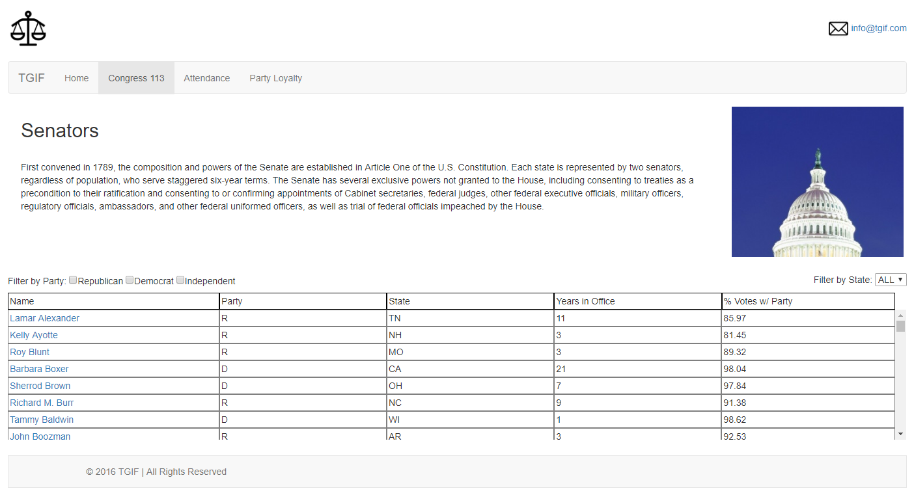
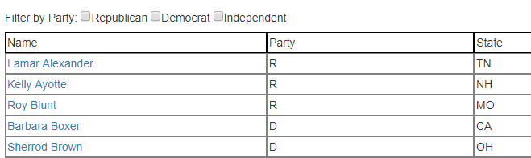
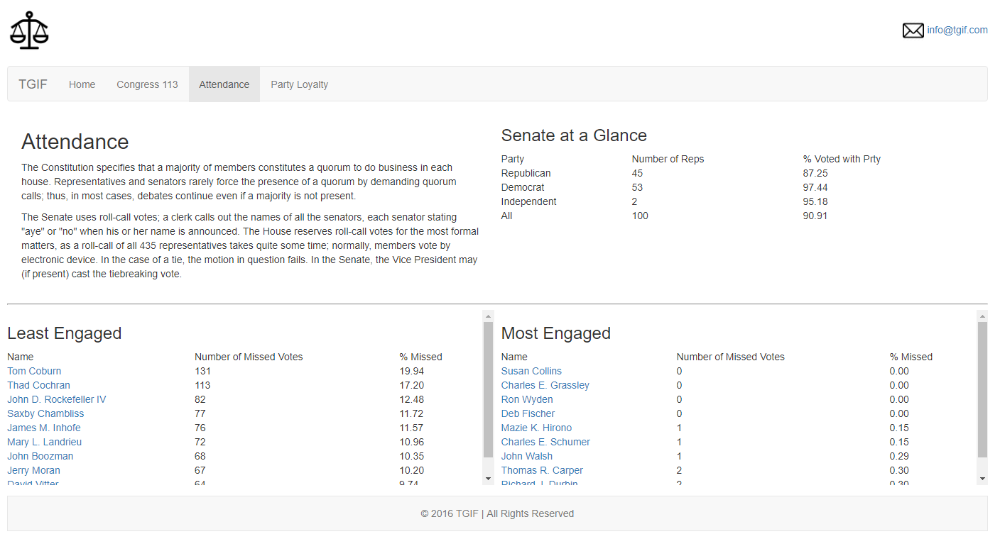

# JS_AJAX_Statistics_Project

A Congressional tracking web site built for Transparent Government in Fact (TGIF), a non-partisan non-profit organization working to increase the public’s involvement in government.
The website using modern JavaScript technologies, including AJAX, JSON, and RESTful APIs to request different sets of data to be diplayed for the user to sort and filter.

## JS Libraries Used

- Bootstrap
- Mustache (Templating)
- jQuery

## Javascript Skills implemented

- Processing data to be sorted and fileterd

- Web template system with mustache.js
- RESTful (Representational State Transfer) APIs
- AJAX (Asynchronous JavaScript and XML) to receive JSON (JavaScript Object Notation) objects
- DOM Manipulation using jQuery and Javascript

## HTML and CSS Skills implemented

- Modern CSS Grid Layout & CSS Flexbox utilization
- Responsive design for varying desktop window sizes using media-queries

